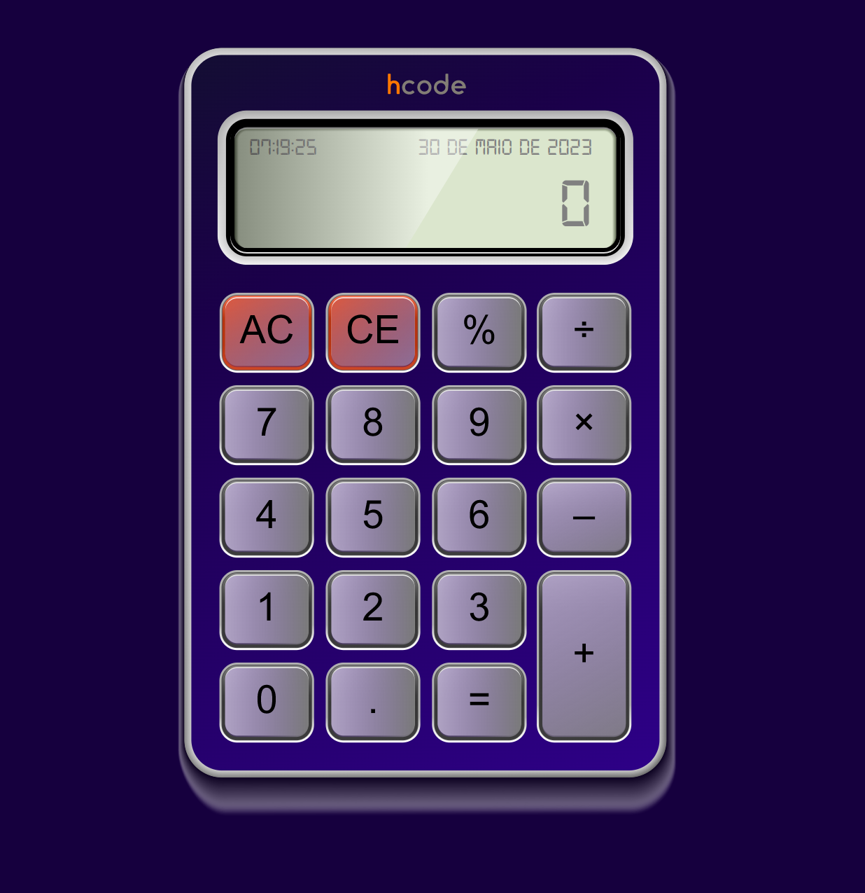

# Calculadora JavaScript

[Hcode Treinamentos](https://www.hcode.com.br)

Calculadora desenvolvida como exemplo do Curso Completo de JavaScript na Udemy.com.

### Projeto

### Utilidade 

- Este código implementa a lógica de uma calculadora em JavaScript. Ele utiliza uma classe CalcController para gerenciar o funcionamento da calculadora. A calculadora exibe o resultado no displayCalcEl, que é um elemento HTML com o ID "display". Além disso, o código também exibe a data no elemento HTML com o ID "data" e o horário no elemento HTML com o ID "hora".

- A classe CalcController possui métodos para realizar as operações matemáticas básicas (adição, subtração, multiplicação e divisão), além de outros métodos auxiliares, como limpar os valores, adicionar o ponto decimal, copiar e colar valores do clipboard, e definir a data e horário atual.

- O código também implementa eventos para interagir com a calculadora usando o teclado e o mouse. Ele faz uso dos eventos keyup, click, drag, mouseover, mouseup e mousedown para executar as ações correspondentes aos botões pressionados ou clicados.

- No geral, este código implementa uma calculadora básica em JavaScript, permitindo que o usuário realize operações matemáticas simples e veja o resultado no display.

### Tecnologe
- HTML;
- JAVASCRIPT;

Mizael Vaz

